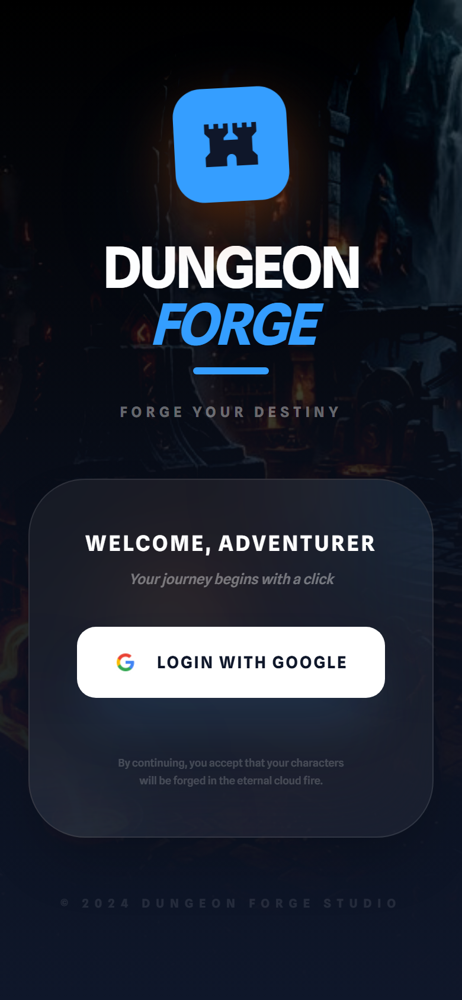
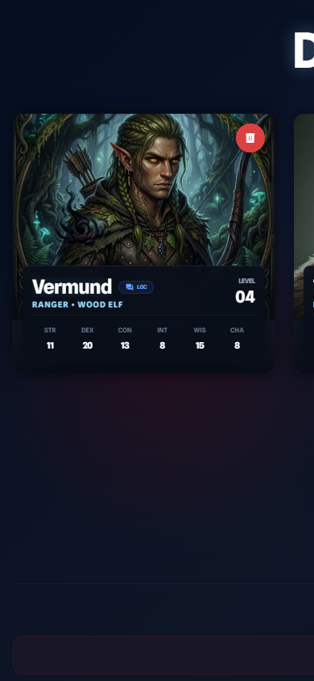
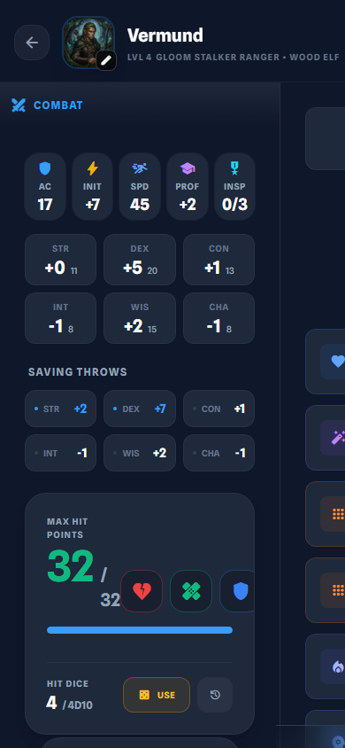
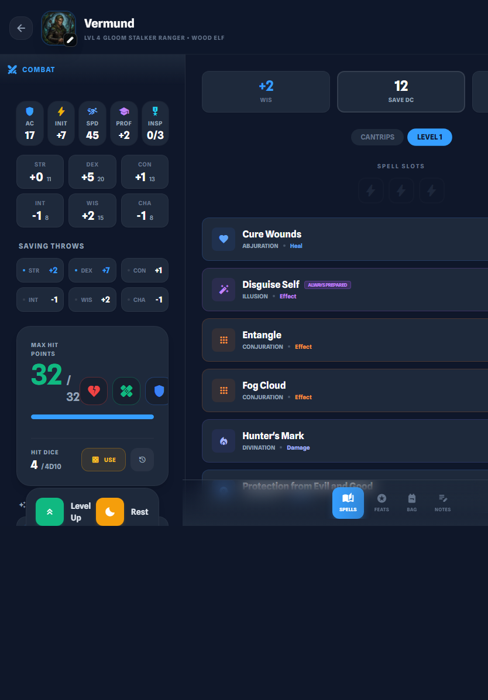
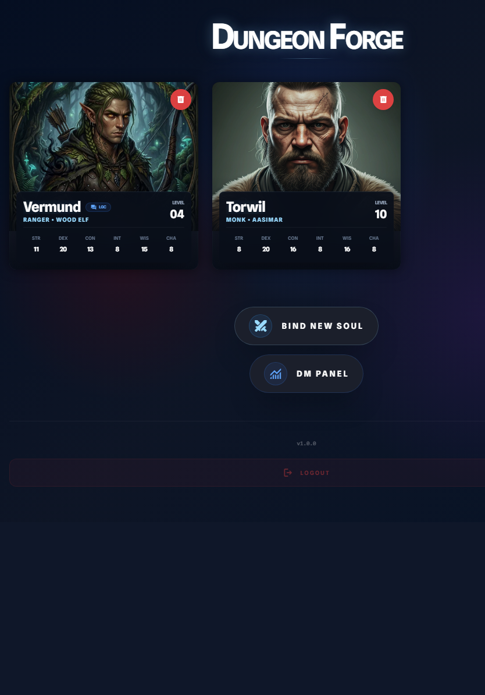

<div align="center">

# ⚔️ Dungeon Forge

### *Forge your destiny*

**Full-featured D&D 5e (2024) character management — web, PWA & mobile**

[](https://react.dev)
[](https://www.typescriptlang.org)
[](https://vitejs.dev)
[](https://tailwindcss.com)
[](https://capacitorjs.com)
[](https://supabase.com)
[](LICENSE)
[](#)

</div>

---

## 📸 Screenshots

<div align="center">

<table>
  <tr>
    <td align="center">
      
      <br/><sub><b>Login mobile (390px) - fondo epico de mazmorra, logo Dungeon Forge</b></sub>
    </td>
    <td align="center">
      
      <br/><sub><b>Lista de personajes - Vermund (Ranger Wood Elf Lv4) en mobile</b></sub>
    </td>
  </tr>
  <tr>
    <td align="center" colspan="2">
      
      <br/><sub><b>Hoja de personaje Vermund - Combat tab con AC 17, Init +7, HP 32/32, hechizos</b></sub>
    </td>
  </tr>
</table>

<p align="center">
  
  <br/><sub><b>Hoja de Vermund en tablet - vista dividida combat stats + spell list</b></sub>
</p>

<p align="center">
  
  <br/><sub><b>Lista de personajes en tablet - Vermund y Torwil cards</b></sub>
</p>

</div>

---

## ✨ Features

| Feature | Description |
|---------|-------------|
| 🧝 **12 D&D 5e 2024 Classes** | Barbarian, Bard, Cleric, Druid, Fighter, Monk, Paladin, Ranger, Rogue, Sorcerer, Warlock, Wizard |
| 📋 **Full Character Sheet** | Stats, combat, inventory, spells (levels 0–9), class features & traits |
| 🧙‍♂️ **5-Step Guided Creator** | Species → Class → Background → Abilities → Review |
| ☁️ **Cloud Sync** | Real-time cross-device sync via Supabase |
| 🎲 **DM Dashboard** | Dungeon Master view to track the whole party |
| 📡 **OTA Updates** | Automatic over-the-air updates on mobile (no store re-publish) |
| 📴 **Offline-Ready PWA** | Service worker for offline play |
| 🔐 **Google OAuth** | Secure login via Supabase Auth |
| ⚔️ **Multiclass Support** | Full multiclassing as per 2024 rules |
| 🎨 **Class Avatars** | Unique illustrated avatar per class |

---

## 🛠️ Tech Stack

| Layer | Technology | Version |
|-------|-----------|---------|
| Frontend | React | 19 |
| Language | TypeScript (strict) | 5 |
| Build | Vite | 5 |
| Styling | Tailwind CSS | 3 |
| Mobile | Capacitor | 6 |
| Backend/Auth | Supabase | 2 |
| OTA | @capgo/capacitor-updater | 6 |
| Platforms | Web, Android, iOS | — |

---

## 🚀 Quick Start

### Prerequisites

- Node.js 20+
- npm 9+
- A [Supabase](https://supabase.com) project (free tier works)

### 1. Clone & Install

```bash
git clone https://github.com/your-username/dungeon-forge.git
cd dungeon-forge
npm install
```

### 2. Configure Environment

Create a `.env` file in the project root:

```env
VITE_SUPABASE_URL=https://your-project.supabase.co
VITE_SUPABASE_ANON_KEY=your-anon-key-here
```

> Get these values from your Supabase project dashboard → **Settings → API**.

### 3. Run Dev Server

```bash
npm run dev
# → http://localhost:5173
```

---

## 📦 Build & Deploy

### Web / PWA

```bash
npm run build
# Output: dist/
```

### Android APK

```bash
npm run build
npx cap sync android
cd android
./gradlew assembleDebug
# Output: android/app/build/outputs/apk/debug/app-debug.apk
```

### OTA Release (mobile update without re-publish)

```bash
npm run ota
```

---

## 📁 Project Structure

```
dungeon-forge/
├── App.tsx                 # Root component & routing
├── types.ts                # Shared TypeScript interfaces
├── constants.ts            # App-wide constants
├── index.css               # Global styles & CSS variables
│
├── components/             # React components
│   ├── CharacterList.tsx   # Hero roster
│   ├── CreatorSteps.tsx    # 5-step character creator
│   ├── SheetTabs.tsx       # Character sheet tabs
│   ├── DMDashboard.tsx     # Dungeon Master panel
│   ├── Login.tsx           # Auth screen
│   └── sheet/
│       ├── CombatTab.tsx   # Combat stats & actions
│       ├── SpellsTab.tsx   # Spell management
│       └── LevelUpWizard/  # Level-up flow
│
├── Data/                   # D&D 5e 2024 data
│   ├── classes/            # 12 class definitions
│   ├── species/            # Species & traits
│   ├── spells/             # Spells by level (0–9)
│   ├── items.ts            # Equipment & items
│   ├── feats.ts            # Feats catalog
│   └── backgrounds.ts      # Backgrounds
│
├── hooks/                  # Custom React hooks
├── utils/                  # Utility functions
└── docs/screenshots/       # App screenshots
```

---

## 🔑 Environment Variables

| Variable | Required | Description |
|----------|----------|-------------|
| `VITE_SUPABASE_URL` | ✅ | Your Supabase project URL |
| `VITE_SUPABASE_ANON_KEY` | ✅ | Your Supabase anonymous public key |

> ⚠️ Never commit your `.env` file. It is already in `.gitignore`.

---

## 🧑‍💻 Development Scripts

```bash
npm run dev          # Start development server
npm run build        # Production build
npm run preview      # Preview production build locally
npm run lint         # Lint with ESLint
npm run lint:fix     # Auto-fix lint errors
npm run test         # Run unit tests (watch mode)
npm run test:run     # Run unit tests once
npm run test:coverage # Run tests with coverage report
npm run ota          # Build + publish OTA update
```

---

## 🗂️ D&D 5e 2024 Classes

<div align="center">

| ⚔️ Barbarian | 🎶 Bard | ✨ Cleric | 🌿 Druid |
|:-----------:|:------:|:-------:|:------:|
| 🗡️ Fighter | 👊 Monk | 🛡️ Paladin | 🏹 Ranger |
| 🥷 Rogue | 🔮 Sorcerer | 👁️ Warlock | 📚 Wizard |

</div>

All classes include:
- Subclass selection at appropriate levels
- Full spell slots and spell lists (spellcasting classes)
- Class-specific resources (Rage, Ki, Superiority Dice, etc.)
- Multiclass support per 2024 rules

---

## 🤝 Contributing

Contributions are welcome! Please follow these steps:

1. Fork the repository
2. Create a feature branch: `git checkout -b feature/amazing-feature`
3. Commit your changes: `git commit -m "feat: add amazing feature"`
4. Push to your branch: `git push origin feature/amazing-feature`
5. Open a Pull Request

Please ensure:
- TypeScript strict mode is respected (no `any`)
- Components stay under 500 lines
- UI text is in Spanish (app language)

---

## 📄 License

This project is licensed under the **MIT License** — see the [LICENSE](LICENSE) file for details.

---

<div align="center">

**D&D 5e content references** are used under fair use for a fan/companion tool.
*Dungeons & Dragons* is a trademark of Wizards of the Coast LLC.

<br/>

Made with ❤️ for adventurers everywhere

⚔️ *Roll for initiative*

</div>
